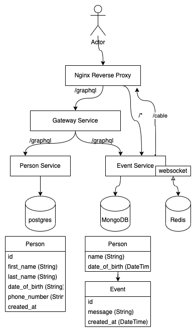

# Description

The whole tech stacks consists of the below services, read more about each in its respective README's:

1. [Event Service](event_service/README.md)
2. [Person Service](person_service/README.md)
3. [Gateway Service](gateway_service/README.md)
4. [Nginx Reverse Proxy](nginx_reverse_proxy/README.md)


# Architecture Diagram




# Running the stack locally

## Event Service

open terminal 1
```
cd event_service
./start-app.sh

# (optional) Just to trace the logs
docker-compose up
```

## Person Service

open terminal 2
```
cd person_service
./start-app.sh

# (optional) Just to trace the logs
docker-compose up
```

## Gateway Service

open terminal 3
```
cd gateway_service
docker-compose up
```

## Gateway Service

open terminal 4
```
cd nginx_reverse_proxy
docker-compose up
```

Then visit `http://localhost/`